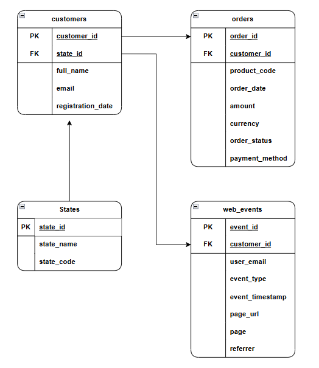

# Documentação do Diagrama de Entidades

---

## Tabela: customers

- **Descrição:** Armazena os dados dos clientes do sistema.

| Campo             | Tipo         | Chave         | Descrição                        |
|-------------------|--------------|---------------|----------------------------------|
| customer_id       | INT          | PK            | Identificador único do cliente   |
| full_name         | VARCHAR      |               | Nome completo do cliente         |
| email             | VARCHAR      | UNIQUE        | E-mail do cliente                |
| registration_date | DATE         |               | Data de cadastro do cliente      |
| birth_date        | DATE         |               | Data de nascimento do cliente    |
| phone_number      | VARCHAR      |               | Telefone do cliente              |
| customer_segment  | VARCHAR      |               | Segmento do cliente              |
| state_id          | INT          | FK (states)   | Estado do cliente                |

---

## Tabela: orders

- **Descrição:** Registra os pedidos realizados pelos clientes.

| Campo        | Tipo     | Chave         | Descrição                          |
|--------------|----------|---------------|------------------------------------|
| order_id     | INT      | PK            | Identificador do pedido            |
| customer_id  | INT      | FK (customers)| Cliente que fez o pedido           |
| product_code | VARCHAR  |               | Código do produto                  |
| order_date   | DATE     |               | Data do pedido                     |
| amount       | DECIMAL  |               | Valor do pedido                    |

---

## Tabela: web_events

- **Descrição:** Armazena eventos de navegação dos clientes.

| Campo          | Tipo     | Chave         | Descrição                          |
|----------------|----------|---------------|------------------------------------|
| event_id       | INT      | PK            | Identificador do evento            |
| customer_id    | INT      | FK (customers)| Cliente relacionado ao evento      |
| event_type     | VARCHAR  |               | Tipo do evento                     |
| event_timestamp| DATETIME |               | Data/hora do evento                |
| device         | VARCHAR  |               | Dispositivo utilizado              |
| browser        | VARCHAR  |               | Navegador utilizado                |
| source         | VARCHAR  |               | Origem do evento                   |

---

## Tabela: states

- **Descrição:** Lista os estados/regiões dos clientes.

| Campo    | Tipo     | Chave | Descrição                |
|----------|----------|-------|--------------------------|
| state_id | INT      | PK    | Identificador do estado  |
| name     | VARCHAR  |       | Nome do estado           |
| code     | VARCHAR  |       | Código do estado         |

---

## Relacionamentos

- `customers.state_id` → `states.state_id`: Cada cliente pertence a um estado.
- `orders.customer_id` → `customers.customer_id`: Cada pedido é feito por um cliente.
- `web_events.customer_id` → `customers.customer_id`: Cada evento de navegação está associado a um cliente.

---

